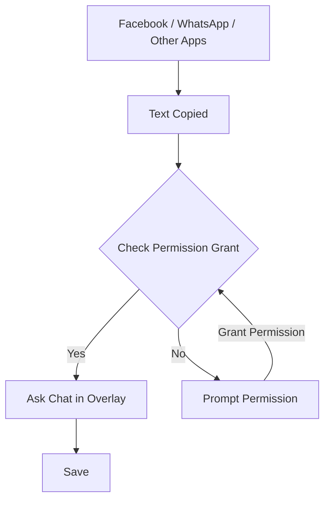
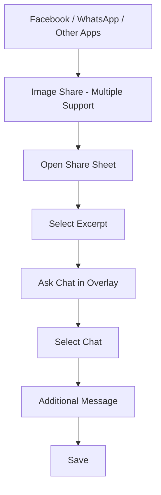

<p align="center">
  
</p>
<h1 align="center">Excerpt</h1>
<h3 align="center">Your <strong>Personal Research & Reference Archive.</strong></h3>

 **Android 10+** · Tested on **Android 16**


## About

**Excerpt** is a personal research and reference archive for saving useful text, images, screenshots, translations, notes, and other references while browsing or using other apps.

The goal is simple:

> Save something useful without breaking your current workflow.

Instead of switching between apps, copying content, opening a notes app, creating a note, and organizing it manually, Excerpt provides a quick capture flow directly over the app you're currently using.

Saved references are organized into **Chats**, making the archive feel familiar and easy to navigate.


## Problem Statement

Research often happens while using completely different applications:

- Facebook
- WhatsApp
- Browser
- Telegram
- PDF readers
- Books and documents
- Other social or productivity apps

When something useful appears, the usual process is:

```text
See useful information
        ↓
Copy / Screenshot
        ↓
Leave current application
        ↓
Open Notes / Notion / Another app
        ↓
Create or find a note
        ↓
Paste / Attach
        ↓
Organize it
````

This creates unnecessary **context switching**.

Because saving takes effort, useful information often gets lost in:

* Clipboard history
* Screenshots
* Downloads
* Random notes
* Chat messages
* Browser bookmarks

Excerpt is designed to reduce that friction.


# Proposed Solution

Excerpt puts the saving workflow closer to where the information is actually found.

## Text Capture



Copy text from another application and Excerpt can provide a lightweight overlay where you can choose where the reference should be saved.

No need to manually open Excerpt first.


## Image Capture



Images can be shared directly to Excerpt through the Android Share Sheet.

Multiple images can also be shared together.


# Features

## Quick Capture

* Capture copied text without manually opening the app.
* Save images directly through the Android Share Sheet.
* Supports multiple images in a single share action.
* Lightweight overlay-based saving flow.
* Designed to minimize context switching.

## Chat-Based Organization

Instead of traditional note cards, Excerpt organizes references into **Chats**.

Each chat acts as a research/reference space.

You can keep different subjects, projects, topics, or research areas in separate chats.


## Reference Archive

Store different types of research material in one place:

* Text
* Images
* Screenshots
* OCR extracted text
* Translations
* Notes
* Source information


## OCR

Images can be processed using on-device OCR to extract readable text.

This makes image-based references searchable and easier to work with later.


## Language Detection

Excerpt can detect the language of extracted text.

This is useful when references come from different languages.


## Bengali Translation

Extracted text can be translated into Bengali while preserving the original content.

The original reference remains available alongside the translation.


## Import & Export

Excerpt includes local **Import / Export** functionality so your archive is not locked inside the application.

Useful for:

* Backups
* Moving data
* Keeping personal archives
* Restoring references
* Future migration


## Offline First

Excerpt is designed to work locally.

Your core references do not require a cloud account or external server to be stored.

This keeps the archive:

* Local
* Private
* Available offline


## Manual Organization

You stay in control of how references are organized.

Create chats/folders for different purposes such as:

```text
Research
├── Machine Learning
├── Cyber Security
├── History
├── Books
└── University

Projects
├── Excerpt
├── PDF Insights
└── Other Projects
```


# Technology

| Technology  | Purpose                                                |
| ----------- | ------------------------------------------------------ |
| **Flutter** | Application UI and cross-platform development          |
| **Kotlin**  | Android native features and system integration         |
| **SQLite**  | Local data storage                                     |
| **ML Kit**  | OCR, language identification and on-device translation |


# Platform

Currently focused on:

**Android**

The project uses Android-native capabilities for features that require interaction with the operating system, such as clipboard capture, overlays and sharing.


# Project Status

> **MVP — Active Development**

The current version focuses on the core local research archive experience:

* Text capture
* Image sharing
* Multiple image support
* Overlay save flow
* Chat-based organization
* OCR
* Language detection
* Bengali translation
* Import / Export
* Offline local storage


# Roadmap

### Current

* [x] Text capture
* [x] Image sharing
* [x] Multiple image support
* [x] Overlay-based save flow
* [x] Chat-based organization
* [x] Local storage
* [x] OCR
* [x] Language detection
* [x] Bengali translation
* [x] Import / Export

### Planned

* [ ] Automatic reference classification
* [ ] Smart folder suggestions
* [ ] PDF capture
* [ ] Browser extension
* [ ] Web application
* [ ] Cloud synchronization
* [ ] Cross-device synchronization
* [ ] Advanced search
* [ ] Better source/reference metadata
* [ ] More attachment types


# Getting Started

## Requirements

Make sure you have:

* Flutter SDK
* Android Studio
* Android SDK
* Kotlin support
* A physical Android device or Android emulator

Check your Flutter environment:

```bash
flutter doctor
```


## Clone the Repository

```bash
git clone https://github.com/Irshad-11/Excerpt.git
cd Excerpt
```

Install dependencies:

```bash
flutter pub get
```

Run the application:

```bash
flutter run
```

> **Note:** Some Excerpt features depend on Android system permissions and may work differently on an emulator. A physical Android device is recommended for testing clipboard, overlay and background-related functionality.


# Permissions

Some features require Android permissions.

Depending on the Android version and device manufacturer, Excerpt may request permissions for:

* Display over other apps
* Notifications
* Background operation
* Clipboard-related functionality
* Battery optimization
* Other Android system integrations

These permissions are required for specific capture features to work correctly.


# Privacy

Excerpt is designed around a **local-first** approach.

The core archive is stored locally on the device using SQLite.

The project does not require an account or cloud server for its core functionality.


# Why "Excerpt"?

An **excerpt** is a selected part of a larger piece of information.

That's exactly what Excerpt is built for:

> Keep the useful part. Keep the context. Build your archive.


# Contributing

Contributions, ideas, bug reports and feature requests are welcome.

If you find a bug or have an idea for improving Excerpt, feel free to open an issue.

For larger changes, opening an issue first is recommended so the proposed change can be discussed before implementation.


# License

License information will be added as the project is finalized.


<p align="center">
  <strong>Excerpt</strong><br>
  Your Personal Research & Reference Archive.
</p>
